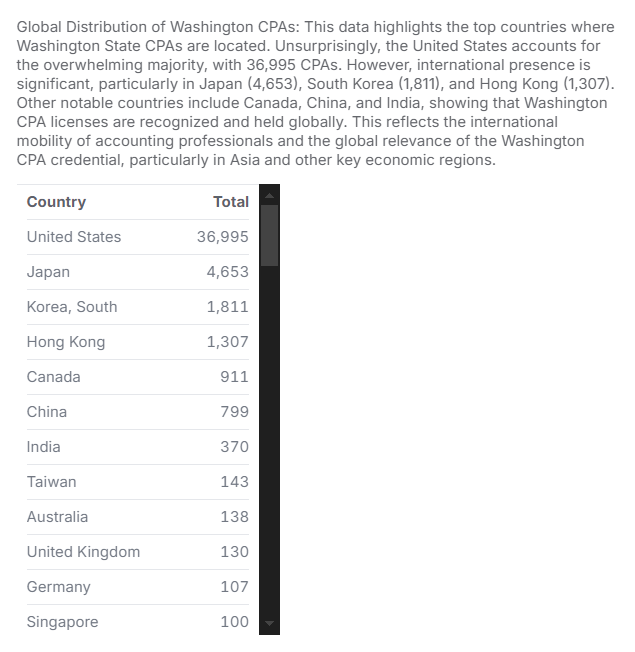
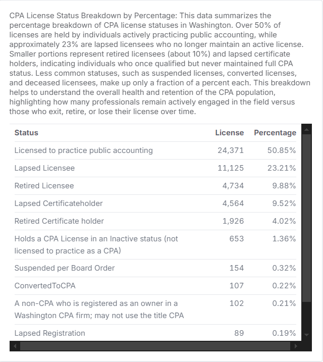
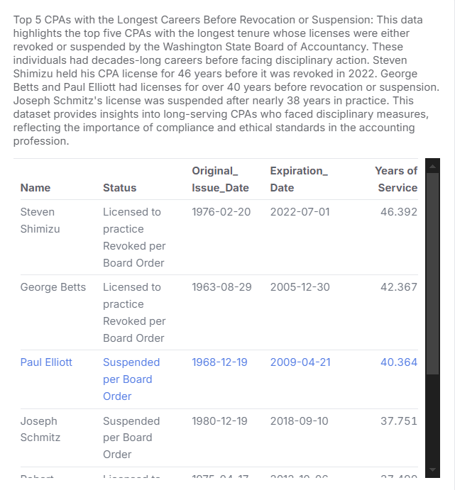
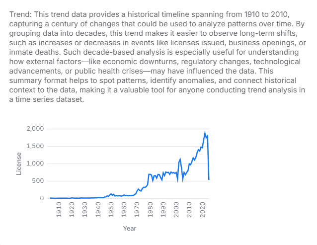

# 📜 Washington State Certified Public Accountants Data 

The data in this repository comes from the [Washington State Open Data Portal](https://data.wa.gov/Consumer-Protection/Washington-State-Certified-Public-Accountants/6du3-3h9e/about_data). It provides **detailed records** on Certified Public Accountants (CPAs) licensed in **Washington State**. 🏛️

## 📌 Overview

This project analyzes CPA licensing data in Washington State, focusing on trends, geographic distribution, and status changes over time. With 47,925 records, the dataset provides details on license holders, including their location, license status, and regulatory history. It serves as a resource for regulators, recruiters, and policymakers to track certification patterns and workforce trends. Given the growing demand for CPAs and a nationwide talent shortage, this analysis offers insights into career pathways, retention rates, and regional concentrations of licensed professionals. While the data facilitates credential verification and disciplinary checks, it does not serve as an official endorsement of any individual or firm.

In Washington State (https://acb.wa.gov/), CPA licenses are valid for three years and must be renewed between January 1 and April 30 (https://acb.wa.gov/individual-licensing/renewal) and the fee for renewal is $230. Additionally, CPA mobility allows licensed CPAs to practice in other states or transfer their licenses, which is why the dataset includes WA-licensed CPAs located in various states and countries.

## 🔍 About the Data

This dataset contains information on **licensed CPAs** in Washington State, including:
- 📛 **Full Name** of the CPA
- 📍 **City, State & Country** where they are based
- 🔢 **License Number** for identification
- 📅 **Original Issue Date & Expiration Dates** of the license
- 📜 **License Status** (Active, Lapsed, Expired, and Suspended.)
- 📌 **Years of Service** 

## Motivation
This project analyzes CPA licensing data to identify trends, track license activity, and map geographic distributions. By examining licensing dates, status changes, and attrition rates, it provides insights into regulatory compliance, workforce trends, and the impact of economic events on new licenses. The dataset serves as a valuable resource for regulators, professional organizations, and researchers, helping to inform policy decisions, improve licensing processes, and enhance oversight of CPA professionals.

## 📊 Summary of Findings

- **Seattle** has the highest number of CPAs, followed by **Bellevue** and **Spokane**.
- A **significant percentage** of licenses are **lapsed or retired**, indicating professional turnover.
- Washington CPAs are also found **internationally**, with licenses held by professionals in **Japan, South Korea, Hong Kong, and China**.
- License issuance **fluctuates over time**, with notable changes around **major economic events** like the **2008 financial crisis** and **COVID-19 pandemic**.
- Analysis of **shortest and longest license holders** shows the **range of professional careers** in the field.

## 📈 Visualizations & Analysis  
This project utilizes **Malloy** for querying and analyzing the dataset. Various **bar charts and line graphs** are included to provide visual insights into CPA licensing trends and geographic distribution. 

### Highlighted Findings from the Data:

This dataset provides a comprehensive analysis of Certified Public Accountant (CPA) licenses in Washington State, covering 47,925 records with details on licensing trends, geographic distribution, and status changes over time. The majority of CPAs are located in Seattle, Bellevue, and Spokane, with a notable international presence in Japan, South Korea, and Hong Kong. Over 50% of licenses are active, while 23% are lapsed, indicating non-renewal.

The data highlights fluctuations in CPA licensing, with 2022 seeing the highest issuance (1,867 licenses) and a decline during the COVID-19 pandemic in 2020. A small fraction of CPAs had licenses revoked or suspended after decades-long careers, emphasizing the importance of compliance and ethical standards.

This dataset serves as a valuable resource for regulators, policymakers, and recruiters by providing insights into licensing patterns, workforce distribution, and retention trends in the accounting profession.

1. CPA License Records.

- The dataset contains 47,925 CPA license records.
- Includes details on license holders' names, locations, and statuses.
- Covers various states and countries, showing CPA distribution.
- Expiration dates are recorded for 46,501 entries.
- Some licenses are marked as Lapsed Licensee, indicating non-renewal.
- Only 78 records include data under the Board Order column.
- Provides insights into CPA licensing trends, including renewal patterns and geographical distribution.


2. By Year: This data presents the yearly trend of CPA licenses issued over time. The numbers fluctuate, indicating variations in new CPA certifications in Washington State. Recent Trends: The number of new licenses has remained relatively stable from 2017 to 2024, with a peak of 1,867 in 2022 and a slight decline in 2023 (1,741) and 2024 (1,794). Impact of Major Events: The COVID-19 pandemic (2020-2021) saw a dip in new licenses (1,452 in 2020), which rebounded in 2022. Declining Numbers Over Time: Compared to earlier years, 2013-2015 had fewer new licenses issued, suggesting a gradual increase in CPA interest in recent years. Future Outlook: The 2025 figure (525) suggests only partial data, but could indicate a slower start for CPA issuances that year. Overall, this dataset reflects fluctuating demand for CPA certifications, potential influences from economic and global events, and steady growth in the profession over the last decade.


3. Geographic distribution of CPA licenses by status


4. Active CPA License Holders

The Malloy code defines a view named CPA_Active_Status to filter and aggregate CPA license data based on their status. It groups the data by CPA status while renaming the column for better readability, then counts the number of licenses within each status group. The dataset is filtered to include only CPAs actively licensed to practice public accounting, excluding other statuses such as lapsed, retired, or suspended. Additionally, a limit of 400,000 records is set to optimize query performance while processing a large dataset. This code helps summarize and extract insights into the number of actively licensed CPAs.


5. Current CPA Licensing Status

- Current CPA Licensing Status Overview
- The graph displays the distribution of CPA license statuses.
- Most licenses fall into the active or lapsed categories.
- Other statuses include retired, suspended, or deceased, representing different career stages.
- Helps track the number of CPAs who remain active versus those who leave the profession.
- Provides insight into license status trends over time and professional retention.


6. Leading 10 Cities for CPAs

- CPA License Distribution by Location
- The data summarizes CPA license counts by city, state, and country.
- Seattle, WA has the highest number of CPA licenses (5,734), followed by:

    - Bellevue, WA (1,714)
    - Spokane, WA (1,357)

- Internationally, notable CPA license counts include:

    - Tokyo, Japan (2,187)
    - Seoul, South Korea (1,360)

- Most CPA licenses are concentrated in Washington State, with other key cities including:

    - Kirkland, Tacoma, Redmond, Renton, and Vancouver

- The distribution highlights the importance of CPAs in major business hubs both in the U.S. and globally.


7. Global Distribution of Washington CPAs

- The data highlights the top countries where Washington State CPAs are located.
- The United States holds the majority of CPA licenses (36,995 CPAs).
- However, there is a significant international presence, particularly in:

    - Japan (4,653 CPAs)
    - South Korea (1,811 CPAs)
    - Hong Kong (1,307 CPAs)

- Other notable countries include:

    - Canada, China, and India

- This distribution demonstrates the global recognition of Washington CPA credentials.
- It highlights the international mobility of accounting professionals.
- The data reflects the strong presence of Washington CPAs in key economic regions, particularly in Asia.



8. Number of Licensed CPAs Changed Over Time

- Annual CPA Licensing Trends (2016–2025)
- This data summarizes the number of CPA licenses issued each year.
- Fluctuations in licensing activity are observed over time.
- Notable increases include:
    - 2024: 1,794 licenses issued.
- Slight declines occurred in certain years, such as:
    - 2020, possibly influenced by the COVID-19 pandemic.
- 2025 (so far) has a lower count (525 licenses issued), likely because the year is not yet complete.
- The data reflects:
    - Economic conditions
    - Regulatory changes
    - Shifts in demand for accounting professionals
- Understanding these trends helps assess the pace of CPA licensing over time.


9. CPA License Status Breakdown by Percentage in Washington

- Over 50% of CPA licenses are actively held by individuals practicing public accounting.
- Approximately 23% of licenses are lapsed, indicating non-renewal.
- Retired licensees account for about 10% of the total.
- Lapsed certificate holders represent individuals who qualified but never maintained full CPA status.
- Less common statuses include:

    - Suspended licenses
    - Converted licenses
    - Deceased licensees

- These categories each make up only a fraction of a percent.
- This data provides insights into the overall retention and turnover of CPAs in Washington.
- Helps identify how many professionals remain active versus those who exit, retire, or lose their license over time.



10. Top 5 CPAs with the Longest Careers Before Revocation or Suspension

- Top CPAs with Longest Tenure Before Revocation or Suspension
- This data highlights five CPAs whose licenses were revoked or suspended after decades-long careers.
- Steven Shimizu held his CPA license for 46 years before revocation in 2022.
- George Betts and Paul Elliott had licenses for over 40 years before facing disciplinary action.
- Joseph Schmitz had his CPA license suspended after nearly 38 years in practice.
- These cases emphasize the importance of compliance and ethical standards in the accounting profession.
- The dataset provides insights into long-serving CPAs who later faced disciplinary measures.



11. Top 20 Cities with the Highest Number of CPA Licenses in Washington

- This analysis is based on the Wa_CPA3.csv dataset, summarizing CPA concentrations by city.
- The data ranks cities by CPA license counts, sorted in descending order.
- Seattle, Bellevue, and Spokane are among the cities with the highest CPA populations.
- The findings highlight key professional hubs where accounting talent is concentrated.
- Employers, firms, and policymakers can use this data to understand CPA workforce distribution.
- This information is valuable for recruitment, policy planning, and regional economic analysis.


12. Historical Trend Analysis (1910-2010)

- Captures a century-long timeline for analyzing long-term patterns.
- Groups data by decades, making it easier to observe shifts over time.
- Helps identify increases or decreases in key events (e.g., CPA licenses, business openings, inmate deaths).
- Useful for understanding the impact of economic downturns, regulatory changes, technological advancements, or public health crises.
- Enables pattern recognition, spotting anomalies, and connecting historical context to the data.
- Provides a valuable tool for time-series analysis across different fields.



## Data Source  
The data originates from the **Washington State Board of Accountancy** and is publicly available through the **Washington State Open Data Portal**. It includes information on individuals who currently hold or have previously held CPA credentials in Washington. The data is collected and maintained by the Washington State Open Data Portal. Each record represents an individual who currently holds or has previously held credentials issued by the Washington State Board of Accountancy.
To inquire about any disciplinary actions taken against a specific individual or firm, please contact the Enforcement Department at (360) 664-9266. For all other inquiries, please contact Customer Service at (360) 753-2586.

## 🎯 Objectives  
- **Analyze CPA licensing trends** over time  
- **Identify geographic distribution** of licensed CPAs  
- **Track license status changes** (Active, Lapsed, Retired, Suspended, etc.)  
- **Assess mobility trends** (CPAs relocating but maintaining licenses)  
- **Examine multi-state practice trends** 

## Repository Contents

- **📊 Dataset**:
  - 🗂️ `Wa_CPA3.csv`: A dataset of Certified Public Accountants in the state of Washington.
  
- **📄 Analysis Scripts**:
  - 📄 `cpa.malloynb`: Has all the sources used in this repository and views that can be used to filter for querying. 
  - 📄 `Images folder`
  
## Malloy Code Files
This repository contains one Malloy code files:
🔗 [Washington State Certified Public Accountants - GitHub Repository](https://github.com/Sky4soft/Washington-State-Certified-Public-Accountants)

👉 **[Click here to view the dataset](https://data.wa.gov/Consumer-Protection/Washington-State-Certified-Public-Accountants/6du3-3h9e)** 

## 📊 Key Visualizations
- **License Issuance Over Time** (line chart)
- **Top Cities for CPAs** (bar chart)
- **License Status Breakdown** (bar chart)

## Further Assistance and Resources

- **[Washington State Board of Accountancy](https://acb.wa.gov/)** – Regulatory Body for CPA Licensing in Washington State.

- **[Washington State CPA firms](https://data.wa.gov/Consumer-Protection/Washington-State-CPA-Certified-Public-Accountant-F/pzcu-jpab/about_data)** -lists firms that hold, or have held credentials from the Washington State Board of Accountancy.

- **[License Verification Tool](https://acb.wa.gov/individual-license-search)** – Verify individual CPA credentials and confirm their current licensing status.

- **[AICPA](https://www.aicpa-cima.com/home)**

## Dataset Information:

(https://data.wa.gov/Consumer-Protection/Washington-State-Certified-Public-Accountants/6du3-3h9e/about_data)
- Source: Washington State CPA Licensing Board
- Date of Extraction: February 26, 2025
- File Format: CSV
- Total Records: 47,925

## Number of active CPAs
The data shows that a total of 24,371 people currently hold an active WA CPA license from 1910 to present. Though these candidates hold the WA CPA license, only 50% are still in WA and the rest are in other States or Countries. This is as a result of CPA mobility, which allows CPA to use their licenses out of state. This dataset helps track how many CPAs maintain their license, even after relocating. 

## Mutual Recognition Agreements (MRAs) between AICPA/NASBA and Professional Accounting Bodies of other Countries. Go to an article: 

(https://www.upliftprofessionals.in/blog/2024/01/mutual-recognition-agreements-mras-between-aicpa-nasba-and-professional-accounting-bodies-of-other-countries/)

## International Licensure Through Reciprocity: "Mutual recognition agreements (MRAs) between professional accounting associations in the U.S. and six other countries allow accountants who have been certified or chartered in any of those countries to qualify to practice in the U.S. without being completely re-credentialed."

The AICPA has formed mutual recognition agreements (MRAs) with nine international accounting bodies, enabling U.S. CPAs to work in these countries with officially recognized credentials. Go to (https://www.tsbpa.texas.gov/general/international-licensure-through-reciprocity.html) find more infomration. 🌎

- South Africa
- Australia
- New Zealand
- Canada
- Hong Kong
- Ireland
- Mexico
- Scotland

# How to Open a Shared GitHub File and Run Malloy Code
To explore the data and run the analyses:

## 1. Open the Shared GitHub File 

Click on the https://github.com/Sky4soft/Washington-State-Certified-Public-Accountants provided to access the shared repository or file. 

Once on Github, click Shift + period this will load the web editor. Then install the malloy extension. See images below for reference:

| **Step**   | **Image Preview** |
|--------|-----------|
| `Step 1 - Press allow` |  |
| `Step 2 - Click the Blocks, search for Malloy, install` |  |
| `Step 3 - Click Trust` |  |
| `Step 4 - Click a .malloynb file` |  |
| `Step 5 - Press Run` |  |

## Questions for Analysis
1. What are the trends in CPA licensing, including renewals, geographic distribution, and lapsed or board-ordered licenses?
2. How has the number of CPA licenses issued changed over time, based on the year of original issuance?
3. What is the current distribution of CPA license statuses, and how many licenses fall into each category (e.g., active, lapsed, retired, suspended, or deceased)?
4. What is the percentage distribution of CPA license statuses in Washington, and how does it reflect the retention and attrition of licensed professionals over time?
5. Which cities in Washington have the highest concentration of licensed CPAs, and how is the distribution of accounting professionals spread across the state?
6. How has the number of CPA licenses issued changed over time from 2016 to 2025, and what factors might have influenced these fluctuations?
7. What are the long-term trends in CPA license issuances from 1910 to 2010, and how have historical events influenced these patterns over time?

## 📝 License & Disclaimer ⚖️

This dataset is provided for educational and research purposes. This dataset is a valuable tool for **researchers, policy makers,employers, CPAs, accounting educators, and the general public** looking to understand the landscape of **certified accountants in Washington State**. 

It may not reflect real-time updates and should not be used for official verification. Please refer to the official Washington State CPA Licensing Board for the most up-to-date information. The files provided directly via data.wa.gov(the official Washingtonn state open data portal) are, as government documents, now in the public domain. This repository’s code is available under the MIT License terms. The Github data files and codes have been generated by Julie Moore for Gonzaga University Graduate School of Business as part of the MSBA-622-01 Data Science for Business (Spring 2025) course. 
For questions or more information, please contact the [Washington State Accountancy Board](https://acb.wa.gov/)

### Example Query (Malloy)  
```malloy
run: CPA -> {
    group_by: `License Number`
}

view: CPA_By_City is {
        group_by: `City` is Clean_City
        aggregate: License
        limit: 400000
    }